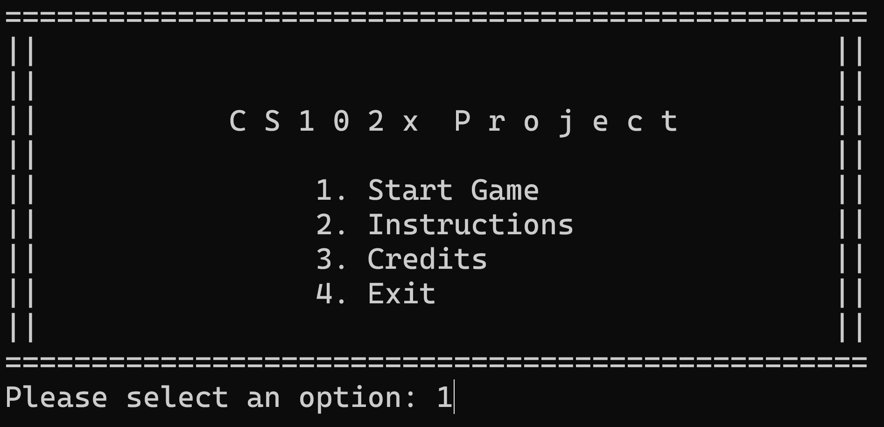
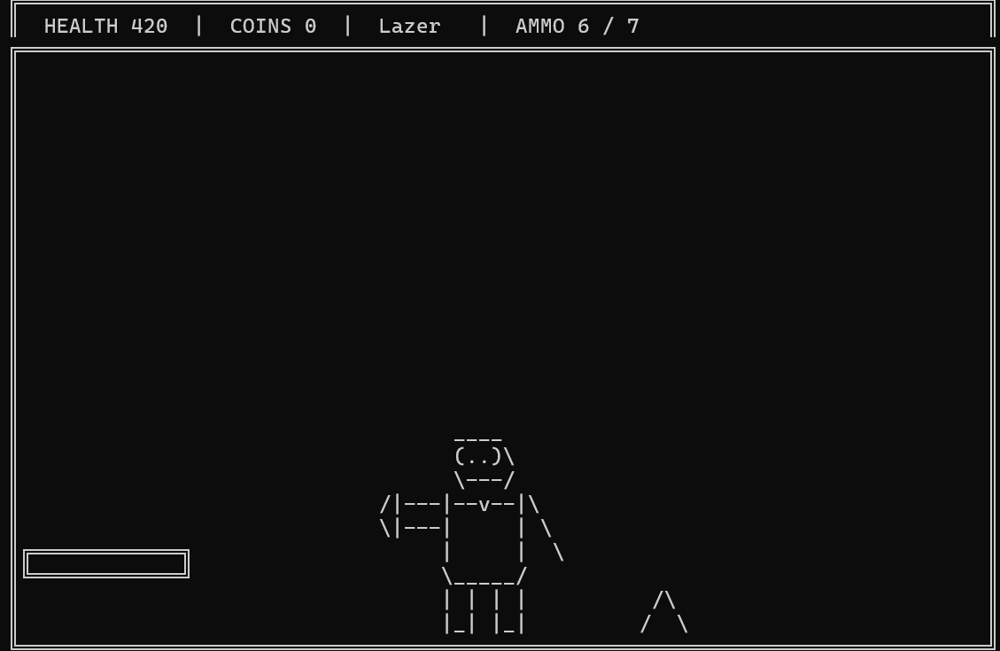
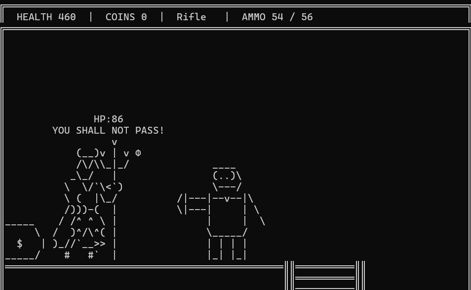
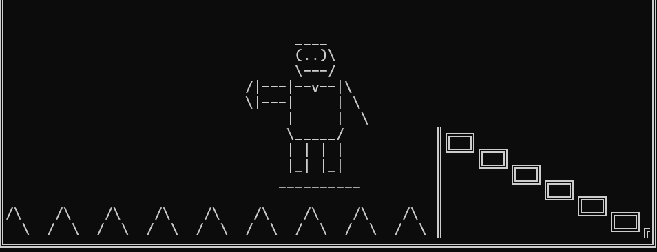
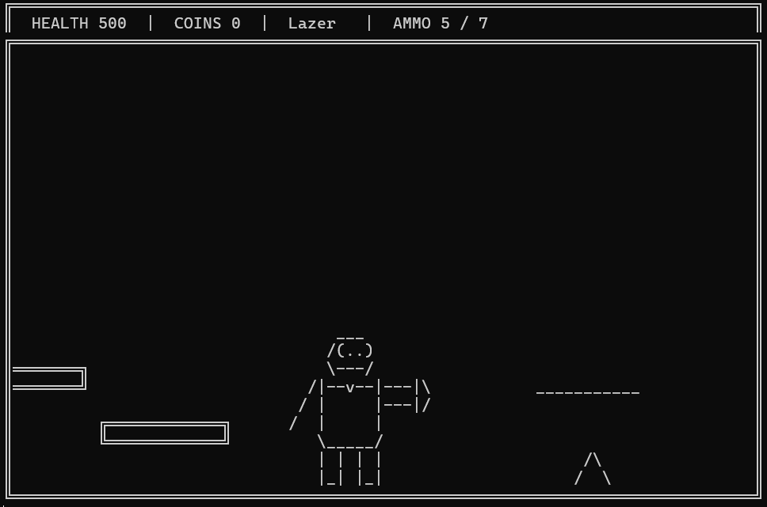
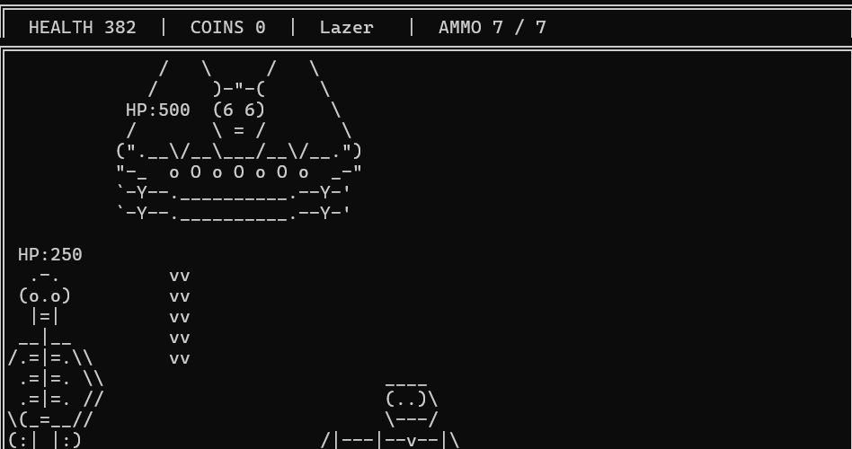

# CS102x Game Project

<p align="right">
  <b>Built using</b>
  
</p>

A large-scale, terminal-based platformer game written in C++ for the CS102x course project. This game features platforming, shooting, enemies, collectables, and a boss fight, all rendered using ASCII graphics.

## Table of Contents

- [Game Overview](#game-overview)
- [Screenshots](#screenshots)
- [Gameplay](#gameplay)
- [Controls](#controls)
- [Features](#features)
- [How to Build and Run](#how-to-build-and-run)
- [Credits](#credits)

---

## Game Overview

You are the hero in a vast ASCII world, filled with platforms, elevators, ladders, enemies, and traps. Your mission is to collect coins, regain health with hearts, find a secret weapon, and ultimately defeat the boss. The game is single-player, played entirely in the terminal, and controlled via keyboard input.

---

## Screenshots

<table>
  <tr>
    <td align="center">
      <b>Main Menu</b><br>
      
    </td>
    <td align="center">
      <b>Game Start</b><br>
      
    </td>
  </tr>
  <tr>
    <td align="center">
      <b>Devil Enemy</b><br>
      
    </td>
    <td align="center">
      <b>Moving Platform</b><br>
      
    </td>
  </tr>
  <tr>
    <td align="center">
      <b>Lazer Weapon</b><br>
      
    </td>
    <td align="center">
      <b>Final Boss</b><br>
      
    </td>
  </tr>
</table>

---

## Gameplay

- **Main Objective:**  
  Collect **10 coins** scattered across the map to unlock the teleporter, which grants access to the boss room. Defeat the boss (after defeating its minions) to win the game.

- **Losing Condition:**  
  If your health reaches zero, you lose.

- **Interaction:**  
  Navigate through various obstacles, avoid enemies and traps, and seek out hidden items. Use ladders and elevators to traverse different map sections.

- **Combat:**  
  Switch between different weapons (laser, pistol, rifle) and use ammo wisely. Enemies have different behaviors and attack patterns.

## Controls

| Key         | Action                                  |
|-------------|-----------------------------------------|
| **W**/Space | Jump / Climb Up                         |
| **A**       | Move Left                               |
| **D**       | Move Right                              |
| **S**       | Climb Down                              |
| **F**       | Shoot                                   |
| **R**       | Reload                                  |
| **T**       | Switch Weapons                          |
| **E**       | Interact (use teleporter, button, etc.) |

## Features

- **ASCII Art Graphics:**  
  All characters, enemies, and objects are drawn using ASCII art.

- **Multiple Enemies:**  
  Including birds, blobs, skeletons, crystals, a "devil", and a boss with unique attacks.

- **Dynamic Map:**  
  Large, scrollable map with platforms, spikes, collectables, hidden ladders, moving elevators, and more.

- **Weapons System:**  
  Switchable weapons (laser, pistol, rifle) with distinct ammo and power.

- **Power-Ups:**  
  Collect hearts to recover health and find a hidden rifle.

- **Challenging Boss Fight:**  
  Defeat minions before being able to kill the boss, while dodging lasers and spikes.

- **HUD:**  
  Displays health, coins, current weapon, and ammo.

- **Sound Effects:**  
  (If supported by your terminal and OS, otherwise sound is not included.)

## How to Build and Run

### Requirements

- **Compiler:**  
  Any C++ compiler that supports C++11 or newer (e.g., g++, clang, MSVC).
- **Operating System:**  
  Windows is recommended (for `<conio.h>` support). On Linux, substitute `_getch()` and `_kbhit()` with suitable alternatives.
- **Terminal:**  
  Large enough to display at least 80x24 characters.

### Build Instructions (Windows, using g++)

```sh
g++ -o cs102x_game Game.cpp
```

### Run

```sh
./cs102x_game
```

If you're on Linux, you must replace `#include <conio.h>` and related functions with appropriate alternatives.

## Credits

Game developed by:
- [KareemH-1](https://github.com/KareemH-1)
- [MazenMDev](https://github.com/MazenMDev)
- [AhmedEmad375](https://github.com/AhmedEmad375)

---

Enjoy the game and have fun exploring!